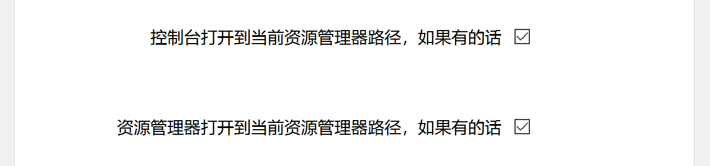

# 猿快键-2.0

[TOC]

## 软件介绍

- 软件主要功能写完了，包括快捷键**快速打开控制台/资源管理器**，**禁用按键/快捷键/鼠标**。

- 支持**开机自启，解压即可使用**。
- 主要是给**程序员**使用的。
- 界面是使用pyside6写的，控制键盘和鼠标用到了Python和C/C++。
- 因为是没事瞎写的，所以界面比较垃圾。

### 技术介绍

- **虚拟键码**
  - [windows系统官方键码链接](https://learn.microsoft.com/zh-cn/windows/win32/inputdev/virtual-key-codes)
  - [虚拟键码表/104键键盘键码表](https://blog.csdn.net/m0_74389553/article/details/144358199?fromshare=blogdetail&sharetype=blogdetail&sharerId=144358199&sharerefer=PC&sharesource=m0_74389553&sharefrom=from_link)
- **C/C++ windows系统下禁用按键/快捷键/鼠标**
  - [C/C++ windows系统下禁用按键/快捷键/鼠标](https://blog.csdn.net/m0_74389553/article/details/144369659?fromshare=blogdetail&sharetype=blogdetail&sharerId=144369659&sharerefer=PC&sharesource=m0_74389553&sharefrom=from_link)

- **python监控按键/快捷键/鼠标**
  - [python监控按键/快捷键/鼠标](https://blog.csdn.net/m0_74389553/article/details/144476696?fromshare=blogdetail&sharetype=blogdetail&sharerId=144476696&sharerefer=PC&sharesource=m0_74389553&sharefrom=from_link)

### 功能介绍

#### 快捷键快速打开控制台/资源管理器

- **快捷键**可以设置为**键盘按键/快捷键/鼠标前进键/鼠标后退键**

- **禁止其他应用使用已录制的快捷键**会使你在上面勾选的快捷键**只能被本程序使用**

- 可以设置**控制台/资源管理器**打开的**默认路径**，使用快捷键会从**打开到设置的路径**

- 如果你想打开**控制台/资源管理器**到**当前打开的资源管理器的路径**，可以**勾选下面按钮**

#### 禁用按键/快捷键/鼠标

##### 下面的操作请谨慎使用，尤其是设置开机自启动情况下！！！

- 点击**添加快捷键**就会在左边添加一个快捷键的输入框

- 勾选**左侧按钮**则表示**开启这个快捷键**（前提是开启本功能）
- **点击快捷键框**就可以**录入快捷键**
- 点击**右侧删除按钮**可以**删除快捷键**

- **勾选启用此功能**并**保存重启**才会**开启功能**

- 禁用鼠标，没什么讲的，看图即可

